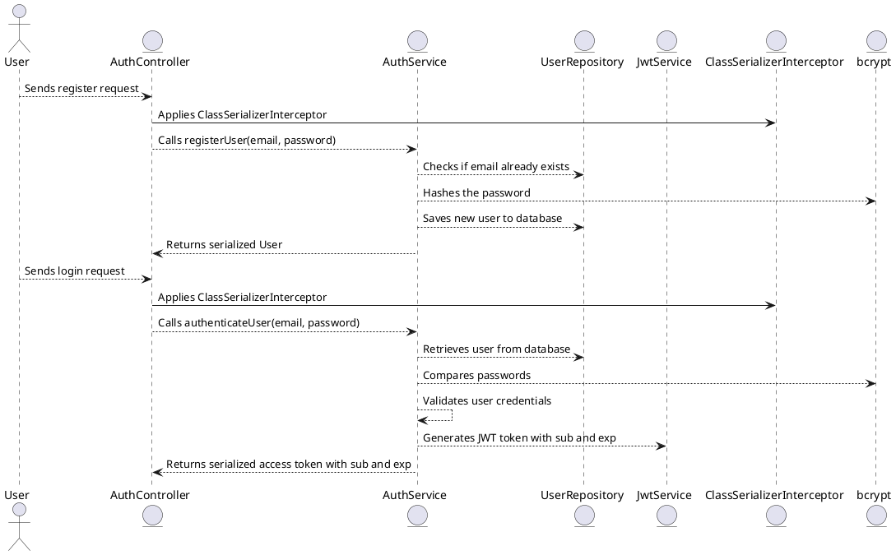

# Auth Service Sequence Diagram

```plantuml
@startuml
actor "User" as user
entity "AuthController" as authController
entity "AuthService" as authService
entity "UserRepository" as userRepository
entity "JwtService" as jwtService
entity "ClassSerializerInterceptor" as interceptor
entity "bcrypt" as bcrypt

user --> authController : Sends register request
authController -> interceptor : Applies ClassSerializerInterceptor
authController --> authService : Calls registerUser(email, password)
authService --> userRepository : Checks if email already exists
authService --> bcrypt : Hashes the password
authService --> userRepository : Saves new user to database
authService --> authController : Returns serialized User

user --> authController : Sends login request
authController -> interceptor : Applies ClassSerializerInterceptor
authController --> authService : Calls authenticateUser(email, password)
authService --> userRepository : Retrieves user from database
authService --> bcrypt : Compares passwords
authService --> authService : Validates user credentials
authService --> jwtService : Generates JWT token with sub and exp
authService --> authController : Returns serialized access token with sub and exp
@enduml
```
