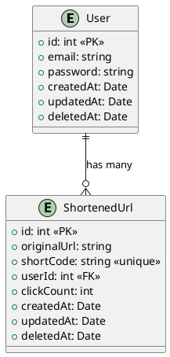

# Initial Database Schema

```plantuml
@startuml

entity User {
  +id: int <<PK>>
  +email: string
  +password: string
  +createdAt: Date
  +updatedAt: Date
  +deletedAt: Date
}

entity ShortenedUrl {
  +id: int <<PK>>
  +originalUrl: string
  +shortCode: string <<unique>>
  +userId: int <<FK>>
  +clickCount: int
  +createdAt: Date
  +updatedAt: Date
  +deletedAt: Date
}

User ||--o{ ShortenedUrl: "has many"

@enduml
```
